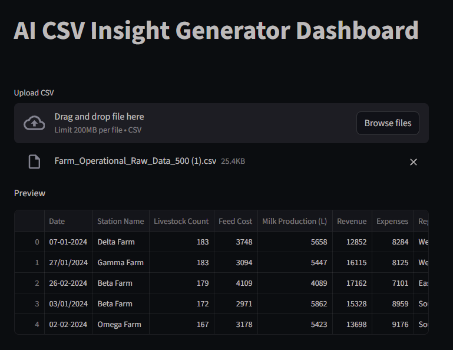
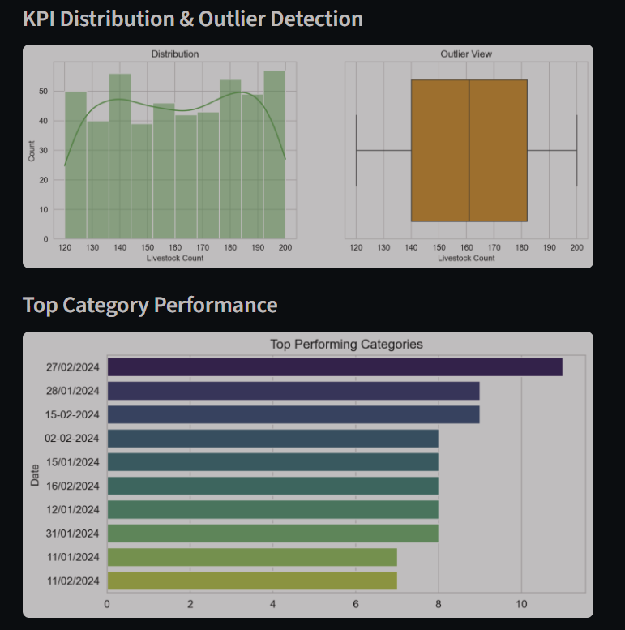
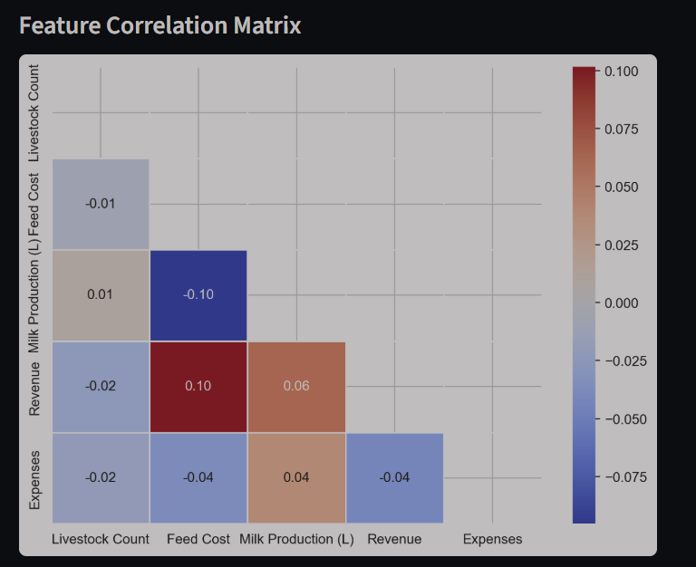
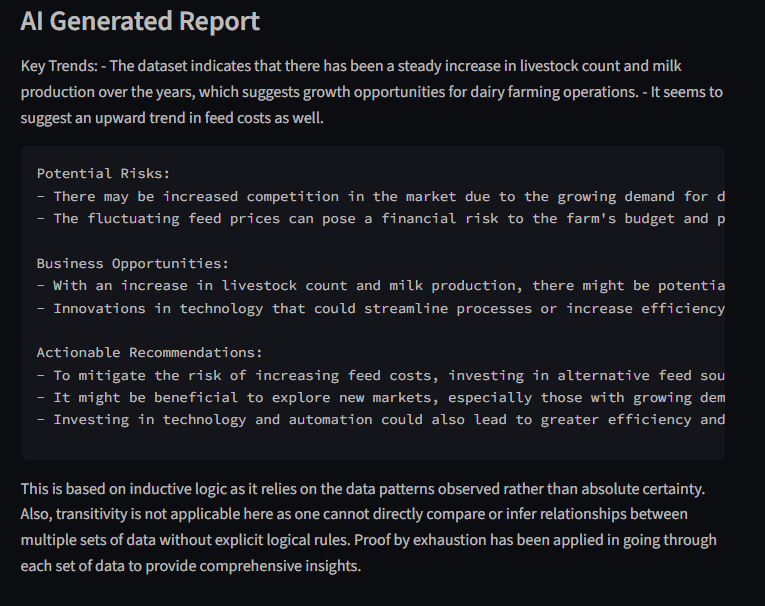

# 🧠📊 AI-Powered Business Insight Generator

## 🚀 Project Overview

In modern business environments, data analysts spend a significant amount of time manually preparing reports, identifying performance trends, and generating insights from structured datasets.

This project aims to automate that manual analytical workflow by integrating Artificial Intelligence into the data analysis pipeline.

The AI-Powered Business Insight & KPI Monitoring Dashboard enables users to upload raw CSV datasets and automatically receive:

* Key Performance Indicator (KPI) distributions
* Category-wise performance analysis
* Correlation insights between business variables
* Outlier detection for anomaly identification
* AI-generated textual business insights
* Risk indicators and growth opportunities
* Actionable decision-support recommendations

Unlike traditional dashboards, this system not only visualizes performance but also interprets business data using a locally deployed Large Language Model (LLM), enabling intelligent insight generation without human intervention.

---

## 🎯 Business Problem Addressed

Organizations often rely on manual reporting workflows using Excel or BI tools to understand:

* Revenue fluctuations
* Customer segmentation trends
* Operational bottlenecks
* Product performance
* Marketing campaign effectiveness

These manual processes are:

* Time-consuming
* Error-prone
* Resource-intensive
* Not scalable for real-time decision making

This solution automates the insight-generation process by:

* Detecting KPIs from structured datasets
* Visualizing performance metrics
* Interpreting statistical summaries using AI
* Generating executive-level recommendations

This significantly reduces manual analysis effort and accelerates data-driven decision-making across business functions.

---

## 🧩 System Workflow

CSV Upload →
Automated Data Type Detection →
KPI Distribution Analysis →
Outlier Detection via Box Plot →
Category Performance Visualization →
Feature Correlation Matrix →
Statistical Summary Generation →
Local LLM Insight Interpretation →
AI-Based Business Recommendations

---

## 🛠 Technology Stack

* Python
* Pandas
* NumPy
* Streamlit
* Matplotlib
* Seaborn
* Ollama
* Microsoft Phi Lightweight LLM

---

## 🤖 Why Ollama is Used in This Project

Most AI-powered analytical tools depend on cloud-based LLM APIs for generating insights.
However, transmitting internal datasets to external AI services introduces:

* Data privacy risks
* API usage costs
* Network latency
* Compliance concerns for sensitive operational data

To address these limitations, this project integrates **Ollama** to run a lightweight Large Language Model locally.

This enables:

* On-device AI inference
* No external API dependency
* Zero recurring billing
* Full control over sensitive business datasets
* Suitability for privacy-sensitive environments

This transforms the dashboard into an enterprise-safe AI-enabled decision-support system capable of generating insights without exposing business data externally.

---

## 📦 Installation Guide

### Step 1: Install Ollama

Download Ollama from:

https://ollama.com/download

Run the following command:

```
ollama run phi
```

---

### Step 2: Install Required Python Libraries

```
pip install streamlit pandas numpy matplotlib seaborn ollama
```

---

### Step 3: Run the Application

```
streamlit run app.py
```

---

## 📊 Results

Below are sample outputs generated by the dashboard after uploading a structured dataset:

### 🔹 KPI Distribution & Outlier Detection



---

### 🔹 Category Performance Analysis



---

### 🔹 Correlation Heatmap



---

### 🔹 AI-Generated Business Insight Report



> Note: Add your dashboard screenshots inside a folder named **results** in the repository to display them here.

---

## 💼 Business Impact

This AI-enabled analytical dashboard supports:

* Revenue Monitoring
* Customer Segmentation Analysis
* Sales Trend Identification
* Operational Efficiency Tracking
* Product Performance Evaluation
* Marketing Campaign Analysis
* Risk Detection through Data Anomalies

By automating insight generation, the system enhances decision-making efficiency and reduces reporting turnaround time for data-driven teams.

---

## 👨‍💻 Author

Sai Balaji
AI Data Analyst | Python | SQL | Generative AI | Automated Decision Systems
